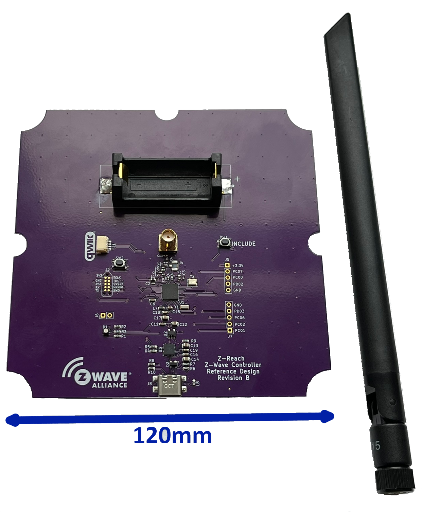

# ZRAD - Z-Wave Reference Application Design

Z-Wave USB Controller with best-in-class RF range Reference Application Design



The Z-Wave Alliance Z-Wave Reference Application Design (ZRAD) is a simple to copy, easy to modify, Open-Source _Reference_ design of a Z-Wave best-in-class RF range device. 
ZRAD is not a product you can purchase, but anyone is welcome to manufacture and sell a product based on ZRAD. 
The objective is to accelerate Time-To-Market for Z-Wave products thru a simple to follow example with detailed step-by-step instructions.  
See the [docs/ZRADTechDocs.docx](docs/ZRADTechDocs.docx) file for more details and the Theory of Operation.

# Setup - Simplicity Studio SDSK 2024.12.0 (Z-Wave 7.23.0)

This setup guide assumes a ZRAD or ZRADmini board has been assembled and is ready for programming.
ZRAD can be programmed as either a Controller or an End Device.
The challenge with Simplicity Studio (SSv5) is that since this is a "custom" board, many of the automatic features of SSv5 do not work.
Many aspects of the sample applications must be manually configured.

## Connect ZRAD to Simplicity Studio

1. Plug ZRAD into a WSTK via the Tag-Connect cable
    - ZRAD can be powered directly from the WSTK - ensure the slide switch next to the battery holder is set to AEM
    - Use a Tag-Connect [TC2050-CLIP](https://www.tag-connect.com/product/tc2050-clip-3pack-retaining-clip) retaining clip to hold the Tag-Connect securely to ZRAD
2. Plug the WSTK into a computer running Simplicity Studio
3. The WSTK should show up in the Debug Adapters pane of the Launcher Perspective
    - if not, click on detect target, if that still doesn't work, use Commander to identify the part
    - if that still doesn't work, check that the WSTK is set to OUT (or Mini) mode
4. Select the WSTK in the debug adapters pane 
    - SSv5 will then list the board as "custom" and Target Part as the ZG23
5. Your ZRAD board can now be programmed with firmware

## Controller

1. Download the SerialAPI using SSv5
    - The standard Demo SerialAPI pre-built for the RB4210 Radio Board will work for ZRAD as the pinouts are similar
        - Select xG23-RB4210A in the My Products pane of the Launcher perspective in SSv5
        - Click on Example Products & Demos Tab
        - Click on Z-Wave
        - Scroll down the list to the Z-Wave - NCP Serial API Controller (US or EU LR) 
        - Click on Run, select the WSTK and SSv5 will program the DUT
        - Note: the pre-built SerialAPI assumes a ZG23B, not ZG23A thus only download to a ZG23B
    - The Demo SerialAPI includes the bootloader
2. OR Build the SerialAPI (required if using a ZG23A or using your own keys)
    - TODO More details to come here...
    - TODO add how to build the serialAPI and add special features - what needs to be done to OTW??? keys???
3. Build the bootloader if also building the SerialAPI 
    - See [DrZWave.Blog](https://drzwave.blog/2024/04/02/how-to-build-the-z-wave-bootloaders) for details

## End Device

### Quick Demo 

The Switch On Off sample application in SSv5 will run out-of-the box on ZRAD as the pinouts are similar to the RB4210 devkit.
Follow these instructions to quickly test a new board.

1. In SSv5, in the Launcher perspective, enter "xG23-RB4210" in the lower left My Products pane, select that kit
2. Click on the Example Projects and Demos tab
3. Click on Z-Wave and uncheck Example Projects and Solution Examples
4. Click on RUN for the desired Demo application, Z-Wave SoC Switch On/Off (US or EU Region) has been tested
5. Choose the WSTK with ZRAD connected and click OK
6. The hex file will download and run. A bootloader is included in the sample application.
7. Right click on the WSTK in Debug Adapters
8. Device Configuration\-\>Z-Wave Device Settings will bring up the QR code and DSK
9. Use the QR code to join a network and write down the first 5 digits of the DSK which is the PIN
    - Press the LEARN button to send a NIF
11. Connect via the Console for other CLI functions (type "help" for a list of commands)
12. The LED will come on because the pins and polarity on ZRAD are different than the RB4210

### Full Feature Build

1. **Build the Bootloader**
    - In SSv5, select your board connected to a WSTK to make sure you are building for the proper chip
    - Click on Detect Target Part and verify the proper Target Part has been detected
    - File-\>New-\>Silicon Labs Project Wizard -\> next (make sure the IDE/Toolchain is V12.x.x or higher)
    - Filter on Z-Wave
    - Select "Bootloader - SoC Internal Storage (OTA for Z-Wave Applications)" - select it, click on Next and then Finish
    - Build & Flash the binary to the device
    - Copy the .HEX or .s37 file to another folder for merging with the app and keys later
    - Note that the Application will NOT start unless there is a bootloader programmed into the DUT
2. **Build the App**
3. Start with the Switch On/Off sample app - optionally use one of the others if applicable
4. File-\>New-\>Silicon Labs Project Wizard
5. Check that IDE/Toochain is set to GNU ARM v12.2.x (and not v10.x.x)
6. Check that the SDK is the latest
7. Next
8. Unselect Solution Examples
9. Select the Z-Wave checkbox
10. Select the Z-Wave SoC Switch On/Off project
11. Next
12. Change the project name to whatever you want
13. Finish - wait for the project to be created
14. **Generate the Keys**
    - Keys are needed to OTA the firmware - do NOT use the sample keys!
        - Keys are unique for each project for ALL revisions. Only generate the keys ONCE per project.
    - Create a folder called "keys" in the project
    - From the keys folder, run Commander:
        - ```commander gbl keygen --type ecc-p256 -o <projectname>_sign.key```
        - ```commander gbl keygen --type aes-ccm  -o <projectname>_encrypt.key```
    - Each unit must have the keys programmed in them using:
        - ```commander flash --tokengroup znet --tokenfile <projectname>_encrypt.key --tokenfile <projectname>_sign.key-tokens.txt --device EFR32ZG23```
        - Or combine the keys, bootloader and app into 1 file:
        - ```commander convert --tokengroup znet --tokenfile <projectname>_encrypt.key --tokenfile <projectname>_sign.key-tokens.txt <bootloaderfilename> <applicationfilename> -o <projectname>_merged.s37 --device EFR32ZG23```
    - Modify the Post Build Editor in SSv5 to use these new keys when creating the OTA file
        - Double click the \*.slpb file which will open the Post Build Editor
        - click on the create_gbl parameter
        - Click on the BROWSE button of the Signing Key, select the *_sign.key from above, then the Encrypt Key and select the *_encrypt.key file

        - To check the keys and Post Build is good, run:
        - ```commander gbl parse *.gbl --decrypt ../keys/<projectname>_encrypt.key --app temp.hex```
            - Should complete without error and copy the application to the temp.hex file
        - To check the keys work, program a unit with the app, keys and bootloader, then increment the version, build it again and OTA the incremented version
14. **Customize the Application**
15. Select the project in the Project Explorer of the Simplicity IDE perspective
16. Select the \*.slcp file
17. Select the Software Components tab
18. Scroll down to Z-Wave and open it (click on the triangle)
19. Click on Z-Wave Core Component gear icon
20. Change the RF Region to the desired value (ex:United States Long Range)
21. Click on the Z-Wave ZAF Component
    - Update the User Icon Type and Installer Icon Type for the specific product
        - See the Z-Wave Plus Assigned Icon Types document in the Z-Wave Alliance specification for details on choosing the proper icons
    - Update the Hardware version, Manufacturer ID, Product Type ID and Product ID
        - Each manufacturer is assigned an Manufacturer ID by the Z-Wave Alliance - search the ZW_classcmd.h for your company name
        - The ProductTypeID and ProductID are each 16 bits and MUST BE UNIQUE for each product within your company. These are the "fingerprint" that uniquely identifes the product. They must NOT change for the lifetime of the project thru all firmware revisions.
    - Update the device type & Multichannel configuration
    - Uncheck the Request S0 Network Key and S2 Unauthenticated network Key (these are obsolete and a security hazard)
    - Check the S2 Access Network Key if the product is a doorlock, garage door opener or other secure entry device
7. Click on Z-Wave Verion Numbers
    - Check the Override application version (TRUE=turns blue)
    - Enter the Application Major and Minor version. Note that the Minor and/or Major version MUST be incremented to OTA the firmware
7. Configure Buttons and LEDs:
    - The project will not build yet because LEDs/buttons are not setup for the sample application
    - Search for "simple" in the Software Components tab of the *.slcp file
    - Click on Platform-\>Driver-\>Button-\>Simple Button-\>btno0-\>Configure
        - General - Interrupt
        - SL_SIMPLE_BUTTON_BTN0 select PC03 and name it TOGGLE
    - Click on Platform-\>Driver-\>Button-\>Simple Button-\>btno1-\>Configure
        - General - Interrupt
        - SL_SIMPLE_BUTTON_BTN1 select PC05 and name it LEARN
    - Click on Platform-\>Driver-\>LED-\>Simple LED-\>led0-\>Configure
        - Active Low
        - SL_SIMPLE_LED_LED0 = PA00 and label it GREEN
    - Click on Platform-\>Driver-\>LED-\>Simple LED-\>led1-\>Configure
        - Active Low
        - SL_SIMPLE_LED_LED1 = PA10 and label it BLUE
    - TODO add LED2 PC04=RED
6. Build the project - it should build OK
    - Flash the DUT
    - Get the QR code or DSK and paste into the PC Controller
    - The DUT should join the Z-Wave network in a few seconds.
    - Send a BASIC ON and the BLUE LED should turn on
    - Send an Indicator SET which should blink the GREEN LED
    - Press the LEARN button which should send a NIF and the GREEN LED should blink
6. Optionally enable debugprint to get messages out the UART for debugging purposes
    - click on Z-Wave Debug Print
    - click on Install
    - SSv5 should also instal the IO Stream USART but sometimes it does not
        - manually install Services-\>IO Stream-\>IO Stream USART
        - Click on configure
        - Choose USART0, Tx=PA08, RX=PA09
        - Build the project
        - If the build fails because USART is undefined, click on Configure in IO Stream USART
        - Click on View Source
            - if #warning "IO Stream USART peripheral is not configured" is at about line 90, then SSv5 didn't properly configure the USART
            - comment out the #warning line, then manually set the next several lines with the proper GPIO vlues (they are pretty obvious).
    - Edit app.c and uncomment the line: #define DEBUGPRINT
9. Note that the Secure Element firmware version MUST be the same as the SDK version the app and bootloader were built with. Ensure you have the proper version when programming production devices.
10. TODO
    - What other stuff should every project update???
    - Default_handler - could write an entire blog post on what it should include
    - 24hr watchdog timer - reboot if no traffic
    - watchdog timer
    - memset/clr optimization?
    - Turn on the iCache?
    - add other command classes
    - SPI?
    - Red LED

## Zniffer

ZRADMini makes a great Zniffer for debugging Z-Wave networking issues. 

1. Connect ZRADMini to a WSTK using the Tag-Connect connector
2. Open Simplicity Studio
3. From the Launcher perspective, in the My Products tab, enter the xG23-RB4210A
    - The RB4210A is a +20dBm devkit using a ZG23B and is pinout compatible with ZRADmini
    - Much easier to simply download the pre-built Zniffer application than trying to configure it for ZRAD
4. Click on the Example Projects tab and select Z-Wave
5. Filter on "zniffer" and choose only Demos
6. Pick the desired Z-Wave - NCP Zniffer Beta (EU\_LR or US\_LR regions) and click on RUN
7. Choose the proper WSTK to program the ZRADMini
8. Unplug from the WSTK and plug into USB
9. Zniffer should detect ZRADMini as a zniffer

# Troubleshooting

- Firmware doesn't seem to start? Did you flash the bootloader? The app won't start without a bootloader.
- If your ZRAD is not able to be detected using SSv5 or commander:
    - Check the ZG23 for solder shorts/opens and check the power supplies
    - Is the WSTK in Out or Mini mode and the slide switch set to AEM?
    - Can Commander detect the part? Simplicity Studio sometimes is unable to detect the part but Commander can and will help debug the issue
    - Is the debug interface locked? Use Commander to Unlock Debug Access or Recover Bricked Device
- If the DUT does not seem to generate any RF traffic, the problem is often due to the wrong Region stored in NVM (IE: EU when you want USLR).
    - To reset the Region token: ```commander flash --tokengroup znet --token MFG_ZWAVE_COUNTRY_FREQ:0xFF -d EFR32ZG23```
    - Note: the token in NVM will override the value set in the firmware so downloading firmware may not fix the problem
- OTA fails with a 0x04 error (someday Silabs will eventually separate this out into more errors)
    - Usually caused by the keys not being programmed into the DUT

# QWIIC Connector Setup

The QWIIC connector on ZRAD makes it easy to connect any of the [Sparkfun](https://www.sparkfun.com/qwiic) sensors or other devices via a standard I2C interface. 
Fortunately SSv5 has the I2CSPM component which makes adding and interfacing to I2C devices fairly easy.
The QWIIC connector is normally only used when implementing ZRAD as an End Device.

## I2CSPM Setup

While I2CSPM seems to work, since it is a polled peripheral it loads the CPU with a lot of polling loops which can make other parts of the system fail. Thus, this driver is not recommended but works fine for prototypes.

1. Click on the .slcp file - select the Software Components tab - enter I2CSPM into the seach bar
2. Click on Platform-\>Driver-\>I2C-\>I2CSPM and Install it
3. Name the component QWIIC
4. Click on Configure
5. Reference clock frequency=0 (default), Speed mode=Fast mode (400kbit/s), Selected Module=I2C0 (or I2C1), SCL=PB00, SDA=PB02
    - Sometimes SSv5 does not properly configure the GPIOs - click on Source
    - Comment out the #warning
    - Uncomment the QWIIC\_PERIPHERAL to be I2C0 (or I2C1)
    - Uncomment the PORT and PIN lines and set them to the correct GPIOs for both SCL and SDA
6. The project should build OK - the I2C peripheral will be automatically initialized
7. The I2CSPM\_Transfer() function is then used to send/receive data over the I2C bus
8. See the Geographic Location Command Class repo for an example using the QWIIC connector

# Railtest

RailTest is required for calibrating the 39MHz crystal on the ZRAD PCB. 
The Z-Wave radio will work fine without calibrating the crystal but MUST be calibrated before measuring the RF range.
The crystal on each ZRAD unit must be individually calibrated within 1ppm to achieve maximum RF range over the lifetime of the board.

## Build Railtest

1. The easiest method is to select a ZG23 Radio board DevKit in the MyProducts in the Launcher persepctive
    - ZRAD uses the same UART IOs as the devkits thus the simple method to build railtest is to use one
    - In the "Enter product name" box, enter "RB4210"
2. In the Example Projects & Demos tab, enter "railtest" in the "Filter on Keywords" box
2. Select the "RAIL - SoC Railtest" project
3. Click on Create
4. Build the project
5. Download the .s37 file to the target
6. Connect via USB using PuTTY, Minicom or other terminal project at 115200 baud
7. Type "help" and the full railtest menu should print out
8. Type "getversion" to see the current version of Rail

# Crystal Calibration

1.	Download RailTest into the DUT
2.	Rx 0
3.	Setzwavemode 1 3
4.	Setzwaveregion 1
5.	Setchannel 2
6.	Settxtone 1 - turns on the radio carrier
7.	Getctune - record the CTUNEXIANA value in hex
8.	Use a spectrum analyzer like the TinySA Ultra with start=908.3 stop=908.6
9.	Measure the peak which the TinySA should display - goal is to be within 1ppm of 908.420MHz (1000Hz)
10.	If the peak is high, set ctune to be a higher value, if low, try a lower value
11.	Settxtone 0
12.	Rx 0
13.	Setctune 0xTTT
14.	Settxtone 1
15.	Measure the peak - go back to step 11 until within 1000Hz (1ppm)

Once the value has been determined, use the following command to program the value:

```commander ctune set --value <ctunevalue> -d EFR32ZG23```

```commander ctune get -d EFR32ZG23``` will return the three ctune values. The "Token" ctune is on-chip one in NVM which is erased if the User Data Page is erased. The DI value is programmed at the Silabs factory in the Data Information page for modules. The Board value is used for Silabs radio boards and thus not applicable for customer boards. 

Note that railtest does NOT program the value in NVM. Railtest will only TEMPORARILY assign the CTUNE value. Commander must be used to program the value permanently.

# Schematic to PCB process

KiCAD is used for the schematic and PCB design. The hardware/ZRAD directory contains the KiCAD database. A PDF of the schematic and PCB are provided for easy review. The Gerbers (used for fabricating PCBs) are in a ZIP file in the gerbers folder. The process to go from the schematic to a fabricated PCB is listed here:

1. Open the Schematic file (ZRAD.kicad_sch) in KiCAD
2. Make any changes to the schematic as desired and run the Electrical Rules Check
3. Save the schematic file - File-\>save
4. File-\>Export-\>netlist - click on Export Netlist and save file to ZRAD&#46;NET
5. Open the Board file (ZRAD.kicad_pcb)
6. Update the board from the schematic - Tools-\>Update PCB from Schematic - click on Update PCB
7. Make any changes to the PCB desired
8. Inspect-\>Design Rules Checker - Click on Run DRC
9. Make sure DRC is clean!
10. Generate the Gerbers and documentation files:
11. File-\>Fabrication Outputs-\>Gerbers - click on PLOT, then Generate Drill Files 
    - All the selected layers will be saved in the chosen folder
12. File-\>Fabrication Outputs-\>Component Placement - click on Generate Position File
13. Delete the ZRAD-bottom.pos file as there are no bottom side components
14. There should be a total of 12 files - add these to a compressed ZIP file and name it ZRAD.zip
15. Delete the 12 gerber files and just keep the ZIP file
16. Review the gerbers using one of the many gerber viewer programs 
    - Check that there is solder mask between the pins of the ZG23 and CP2102
    - if not, check the Board Setup-\>Board Stackup-\>Solder Make/Paste-\>Solder mask expansion is set to 0.0508mm (not zero)
    - Note that 0 leaves it up to the PCB manufacturer who often will use a 3mm expansion which will results in all the pads being shorted to each other as there is no mask between the pads 
17. Plot the schematic - File-\>Plot plot to PDF and save as ZRAD.pdf
18. Print the Fab drawing from the board editor - File-\>Print save landscape fit-to-page as ZRAD_FabricationDwg.pdf
    - Select layers F.Silkscreen, F.Mask, User.Comments, Edge.Cuts and print in black and white
19. Order PCBS!
    - OSHPark.com is recommended - Use the gerbers and NOT the KiCAD files as the gerbers will give you exactly what is plotted, the PCB house may use other defaults for various clearances which might cause problems
    - May 2024 cost $233 for 3 boards
20. Order a Stencil using the ZRAD-F_Paste.gtp file

Order components from the BOM for the needed quantity. Once everything arrives, use the stencil to swipe a layer of solder paste onto the PCBs, place the components by hand, then bake in an IR oven, clean up any solder issues. PCBs are now ready to test!

# Directory Structure

- 3D - mechanical drawings for jigs and enclosures
- docs - documentation folder
    - Datasheet
    - Technical reference manual and theory of operation
- hardware - PCB board design, bill of materials, Gerbers, KiCAD schematic and layout
- sofware - various hex files for quick testing purposes
- Test - Documents and scripts for testing

# Reference Documents

- See the [docs/ZRADTechDocs.docx](docs/ZRADTechDocs.docx) for detailed technical information on this project
- [EFR32ZG23](https://www.silabs.com/documents/public/data-sheets/efr32zg23-datasheet.pdf) Datasheet - features and electrical specification
- [EFR32xG23](https://www.silabs.com/documents/public/reference-manuals/efr32xg23-rm.pdf) Reference Manual - peripherals details 

