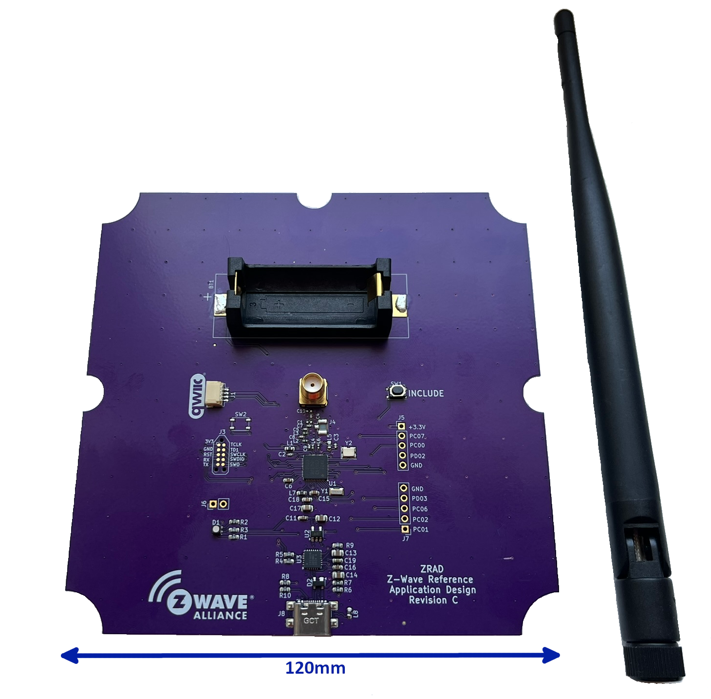

# ZRAD - Z-Wave Reference Application Design

Z-Wave USB Controller with best-in-class RF range Reference Application Design



The Z-Wave Alliance Z-Wave Reference Application Design (ZRAD) is a simple to copy, easy to modify, Open-Source _Reference_ design of a Z-Wave best-in-class RF range device. 
ZRAD is not a product you can purchase, but anyone is welcome to manufacture and sell a product based on ZRAD. 
The objective is to accelerate Time-To-Market for Z-Wave products thru a simple to follow example with detailed step-by-step instructions.  
See the [docs/ZRADTechDocs.docx](docs/ZRADTechDocs.docx) file for more details and the Theory of Operation.

# Setup - Simplicity Studio GDSK 4.4.2 (Z-Wave 7.21.2)

This setup guide assumes a ZRAD board has been assembled and is ready for programming.
ZRAD can be programmed as either a Controller or an End Device.
ZRAD uses the Silicon Labs EFR32ZG23A Z-Wave chip as the Z-Wave interface.
The challenge with Simplicity Studio (SSv5) is that since this is a "custom" board, many of the automatic features of SSv5 do not work.
Many aspects of the sample applications must be manually configured.

## Connect ZRAD to Simplicity Studio

1. Plug ZRAD into a WSTK via the Tag-Connect cable
    - ZRAD can be powered directly from the WSTK - ensure the switch next to the battery holder is set to AEM
    - Use a Tag-Connect [TC2050-CLIP](https://www.tag-connect.com/product/tc2050-clip-3pack-retaining-clip) retaining clip to hold the Tag-Connect securely to ZRAD
2. Plug the WSTK into a computer running Simplicity Studio
3. The WSTK should show up in the Debug Adapters pane of the Launcher Perspective
    - if not, click on detect target, if that still doesn't work, use Commander to identify the part part
    - if that still doesn't work, check that the WSTK is set to OUT (or Mini) mode
    - if that doesn't work, check the ZG23 for solder shorts/opens and check the power supplies
4. Select the WSTK in the debug adapters pane 
    - SSv5 will then list the board as "custom" and Target Part as the ZG23
5. Your ZRAD board can now be programmed with firmware

## Controller

1. Download the SerialAPI using SSv5
    - The standard SerialAPI pre-built for the RB4210 Radio Board will work for ZRAD as the pinouts are the same
        - Note that the SerialAPI assumes a ZG23B, not ZG23A thus only download to a ZG23B
    - The Demo SerialAPI includes the bootloader
2. OR Build the SerialAPI (required if using a ZG23A or using your own keys)
2. Build the bootloader if also building the SerialAPI 
    - See [DrZWave.Blog](https://drzwave.blog/2024/04/02/how-to-build-the-z-wave-bootloaders) for details

## End Device

1. Build the Bootloader
    - In SSv5, select your board connected to a WSTK to make sure you are building for the proper chip
    - Click on Detect Target Part and verify the proper Target Part has been detected
    - File-\>New-\>Silicon Labs Project Wizard
    - Filter on Z-Wave
    - Scroll down to "Bootloader - SoC Internal Storage (For Z-Wave Applications)" - select it, click on Create
    - Build it & Flash the binary to the device
    - Note that the Application will NOT start unless there is a bootloader programmed into the DUT
3. Start with the Switch On/Off sample app - optionally use one of the others if applicable
4. File-\>New-\>Silicon Labs Project Wizard
4. Check that IDE/Toochain is set to GNU ARM v12.2.x (and not v10.x.x)
4. Check that the SDK is the latest
4. Next
4. Unselect Solution Examples
4. Select the Z-Wave checkbox
4. Select the Z-Wave SoC Switch On/Off project
4. Next
4. Change the project name to whatever you want
4. Finish - wait for the project to be created
4. Select the project in the Project Explorer of the Simplicity IDE perspective
4. Select the <proj>.slcp file
5. Select the Software Components tab
5. Scroll down to Z-Wave and open it (click on the triangle)
5. Click on Z-Wave Core Component gear icon
5. Change the RF Region to the desired value (United State Long Range)
6. Optionally enable debugprint to get messages out the UART for debugging purposes
    - click on Z-Wave Debug Print
    - click on Install
    - SSv5 should also instal the IO Stream USART but sometimes it does not
        - manually install Services-\>IO Stream-\>IO Stream USART
        - Click on configure
        - Choose USART0, Tx=PA08, RX=PA09
        - Build the project
        - If the build fails because USART is undefined, click on Configure in IO Stream USART
        - Click on View Source
            - if #warning "IO Stream USART peripheral is not configured" is at about line 90, then SSv5 didn't properly configure the USART
            - comment out the #warning line, then manually set the next several lines with the proper GPIO vlues (they are pretty obvious).
    - Edit app.c and uncomment the line: #define DEBUGPRINT
6. Build the project - it should build OK
    - If the build fails because APP\_BUTTON\_A or APP\_LED\_A is not defined:
        - From the IDE perspective, right click the project then at the bottom select Properties
        - Open C/C++ Build, then Settings
        - Open GNU ARM C Compiler then Preprocessor
        - scroll down to find the RADIO_BOARD_EFR32ZG23=1 and delete it
        - Then in GNU ARM Assembler Symbols, find it again and delete it
        - Sometimes this setting comes back after configuring other things in the SLCP and may need to be deleted again
        - The project should then build OK
7. Configure buttons and LEDs
    - The project built so far won't run. It will enter Default\_Handler because LEDs/buttons are not setup
7. Click on the .slcp file and select the Software Components then scroll down to Z-Wave Boards and click on the gear icon
7. Set Button1 On value=Active low, Button2 On Value Active low, Button2 Wake up from EM4 to ON (blue)
7. Scroll down to PB1\_GPIO=PC03, PB2\_GPIO=PC05 and name it LEARN - leave the rest at their defaults
7. Set LED1, LED2 and LED3 ON value = Active Low
7. Set LED1\_GPIO=PA00 name=GREEN, LED2\_GPIO=PA10 name=BLUE, LED3\_GPIO=PC04 name=RED
    - Open the source files and check they are configured properly - sometimes SSv5 fails to configure them:
    - radio\_no\_board\_led.c - assign all 3 LEDs in a similar fashion

```
#define LED1_LABEL           "LED0"
#ifndef LED1_GPIO_PORT                          
#define LED1_GPIO_PORT                           gpioPortA
#endif
#ifndef LED1_GPIO_PIN                           
#define LED1_GPIO_PIN                            0
#endif
```

    - radio\_no\_board\_button.c

```
#ifndef PB2_GPIO_PORT                           
#define PB2_GPIO_PORT                            gpioPortC
#endif
#ifndef PB2_GPIO_PIN                            
#define PB2_GPIO_PIN                             5
#endif
```

    - PB1 must be assigned to gpio port gpioPortC pin 3

8. Build and download - press the INCLUDE button should send a Z-Wave NIF and cause the blue LED to blink. Send a BASIC SET ON should turn the green LED on.

# QWIIC Connector Setup

The QWIIC connector on ZRAD makes it easy to connect any of the SparkFun sensors or other devices via a standard I2C interface. 
Fortunately SSv5 is able to add the I2CSPM component which makes adding and interfacing to I2C devices fairly easy.
The QWIIC connector is normally only used when implementing ZRAD as an End Device.

## I2CSPM Setup

While I2CSPM seems to work, since it is a polled peripheral it loads the CPU with a lot of polling loops which can make other parts of the system fail. Thus, this driver is not recommended.

1. Click on the .slcp file - select the Software Components tab - enter I2CSPM into the seach bar
2. Click on Platform-\>Driver-\>I2C-\>I2CSPM and Install it
3. Name the component QWIIC
4. Click on Configure
5. Reference clock frequency=0 (default), Speed mode=Fast mode (400kbit/s), Selected Module=I2C0 (or I2C1), SCL=PB00, SDA=PB02
    - Sometimes SSv5 does not properly configure the GPIOs - click on Source
    - Comment out the #warning
    - Uncomment the QWIIC\_PERIPHERAL to be I2C0 (or I2C1)
    - Uncomment the PORT and PIN lines and set them to the correct GPIOs for both SCL and SDA
6. The project should build OK - the I2C peripheral will be automatically initialized
7. The I2CSPM\_Transfer() function is then used to send/receive data over the I2C bus
8. See the Geographic Location Command Class repo for an example using the QWIIC connector

# Railtest

RailTest is required for calibrating the 39MHz crystal on the ZRAD PCB. 
The Z-Wave radio will work fine without calibrating the crystal but for MUST be calibrated before measuring the range.
The crystal on each ZRAD unit must be individually calibrated within 1ppm to achieve maximum RF range over the lifetime of the board.

## Build Railtest

1. The easiest method is to select a ZG23 Radio board DevKit in the MyProducts in the Launcher persepctive
    - ZRAD uses the same UART IOs as the devkits thus the simple method to build railtest is to use one
    - In the "Enter product name" box, enter "RB4210"
2. In the Example Projects & Demos tab, enter "railtest" in the "Filter on Keywords" box
2. Select the "RAIL - SoC Railtest" project
3. Click on Create
4. Build the project
5. Download the .s37 file to the target
6. Connect via USB using PuTTY, Minicom or other terminal project at 115200 baud
7. Type "help" and the full railtest menu should print out
8. Type "getversion" to see the current version of Rail

# Crystal Calibration

1.	Download RailTest into the DUT
2.	Rx 0
3.	Setzwavemode 1 3
4.	Setzwaveregion 1
5.	Setchannel 2
6.	Settxtone 1 - turns on the radio carrier
7.	Getctune - record the CTUNEXIANA value in hex
8.	Use a spectrum analyzer like the TinySA Ultra with start=908.3 stop=908.6
9.	Measure the peak which the TinySA should display - goal is to be within 1ppm of 908.420MHz (1000Hz)
10.	If the peak is high, set ctune to be a higher value, if low, try a lower value
11.	Settxtone 0
12.	Rx 0
13.	Setctune 0xTTT
14.	Settxtone 1
15.	Measure the peak - go back to step 11 until within 1000Hz (1ppm)

Once the value has been determined, use the following command to program the value:

```commander ctune set --value <ctunevalue> -d EFR32ZG23```

Note that railtest does NOT program the value in NVM. Railtest will only TEMPORARILY assign the CTUNE value. Commander must be used to program the value permanently.

# Schematic to PCB process

KiCAD is used for the schematic and PCB design. The hardware/ZRAD directory contains the KiCAD database. A PDF of the schematic and PCB are provided for easy review. The Gerbers (used for fabricating PCBs) are in a ZIP file in the gerbers folder. The process to go from the schematic to a fabricated PCB is listed here:

1. Open the Schematic file (ZRAD.kicad_sch) in KiCAD
2. Make any changes to the schematic as desired and run the Electrical Rules Check
3. Save the schematic file - File-\>save
4. File-\>Export-\>netlist - click on Export Netlist and save file to ZRAD&#46;NET
5. Open the Board file (ZRAD.kicad_pcb)
6. Update the board from the schematic - Tools-\>Update PCB from Schematic - click on Update PCB
7. Make any changes to the PCB desired
8. Inspect-\>Design Rules Checker - Click on Run DRC
9. Make sure DRC is clean!
10. Generate the Gerbers and documentation files:
11. File-\>Fabrication Outputs-\>Gerbers - click on PLOT, then Generate Drill Files 
    - All the selected layers will be saved in the chosen folder
12. File-\>Fabrication Outputs-\>Component Placement - click on Generate Position File
13. Delete the ZRAD-bottom.pos file as there are no bottom side components
14. There should be a total of 12 files - add these to a compressed ZIP file and name it ZRAD.zip
15. Delete the 12 gerber files and just keep the ZIP file
16. Review the gerbers using one of the many gerber viewer programs 
    - Check that there is solder mask between the pins of the ZG23 and CP2102
    - if not, check the Board Setup-\>Board Stackup-\>Solder Make/Paste-\>Solder mask expansion is set to 0.0508mm (not zero)
    - Note that 0 leaves it up to the PCB manufacturer who often will use a 3mm expansion which will results in all the pads being shorted to each other as there is no mask between the pads 
17. Plot the schematic - File-\>Plot plot to PDF and save as ZRAD.pdf
18. Print the Fab drawing from the board editor - File-\>Print save landscape fit-to-page as ZRAD_FabricationDwg.pdf
    - Select layers F.Silkscreen, F.Mask, User.Comments, Edge.Cuts and print in black and white
19. Order PCBS!
    - OSHPark.com is recommended - Use the gerbers and NOT the KiCAD files as the gerbers will give you exactly what is plotted, the PCB house may use other defaults for various clearances which might cause problems
    - May 2024 cost $233 for 3 boards
20. Order a Stencil using the ZRAD-F_Paste.gtp file

Order components from the BOM for the needed quantity. Once everything arrives, use the stencil to swipe a layer of solder paste onto the PCBs, place the components by hand, then bake in an IR oven, clean up any solder issues. PCBs are now ready to test!

# Directory Structure

- docs - documentation folder
    - Datasheet
    - Technical reference manual and theory of operation
- hardware - PCB board design, bill of materials, Gerbers, KiCAD schematic and layout
- sofware - various hex files for quick testing purposes
- Test - Documents and scripts for testing

# Reference Documents

- See the [docs/ZRADTechDocs.docx](docs/ZRADTechDocs.docx) for detailed technical information on this project
- [EFR32ZG23](https://www.silabs.com/documents/public/data-sheets/efr32zg23-datasheet.pdf) Datasheet - features and electrical specification
- [EFR32xG23](https://www.silabs.com/documents/public/reference-manuals/efr32xg23-rm.pdf) Reference Manual - peripherals details 

