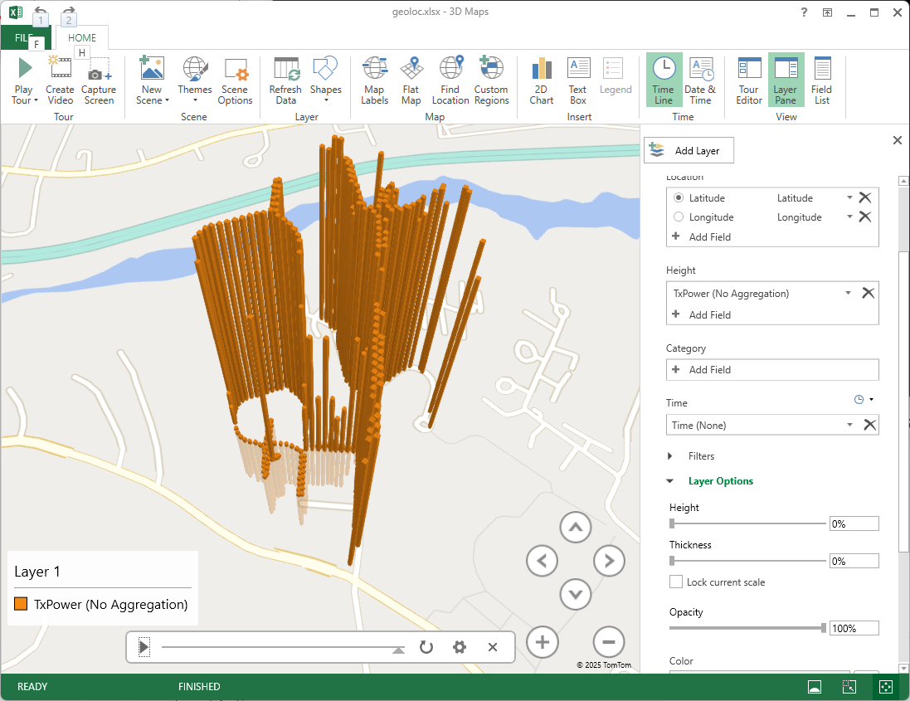
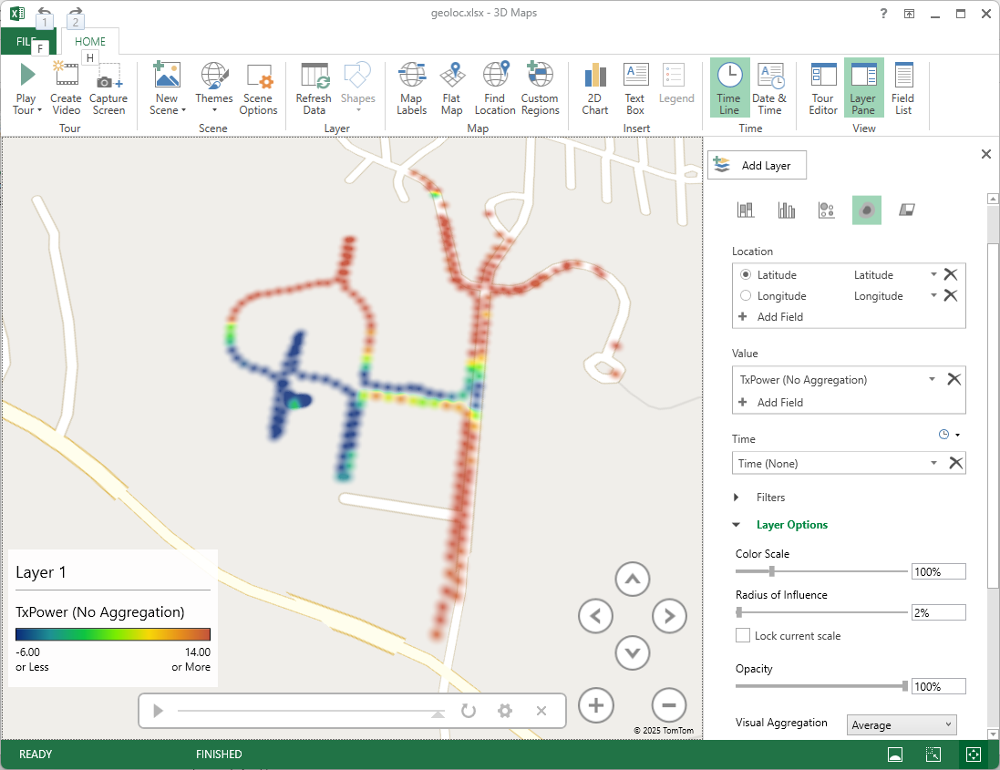
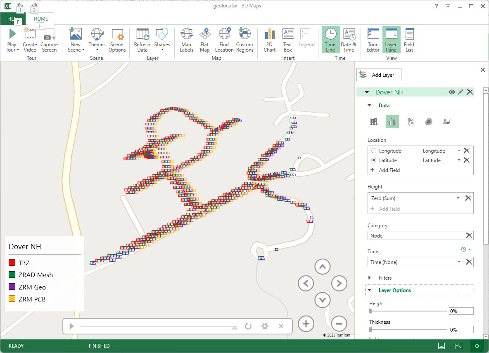

# ZRAD RF Range Testing Folder

There are word files and some raw data files of various range tests done with ZRAD in this folder.
The script to generate most of the data is the ZWJSRangeTest.js file which requires the following procedure to run:

1. Use either a Windows or Linux laptop (windows described here but Linux is similar)
    - install either a bash shell or WSL or use PowerShell
    - install [node.js](https://nodejs.org/en/download)
2. Connected at least one End Device with a GPS receiver and Geographic Location CC v2 and up to 3 other nodes
3. Use Z-Wave JS UI to add/remove nodes using QR codes and/or reset the controller
    - Or use the PC Controller from Silabs 
        - note! copy the Keys from ZWJSRangeTest.js into the PCC Security tab 
4. ```npm zwave-js``` will install zwave-js into this directory
5. ```node ZWJSRangeTest.js [COMx]``` starts Z-Wave JS with many messages scrolling quickly
    - The nodes are interviewed each time the script is run
    - If something fails, try rerunning the script and the interview should complete ok
6. If the Node with Geographic Location CC v2 is working you should get something similar to:
    - ```Lat= 43.170780539512634 Lon= -70.87131237983704 alt= 34.5 Sats= 7```
    - Then you know the test is running
    - ZWJS prints out all sorts of information on the signal quality
7. ```tail -f geoloc.csv``` will show the GPS points as they are being captured
8. Use the Zniffer to watch the Z-Wave traffic
9. Move the GeoLoc DUT until it is no longer making connection, then return
    - Need one person watching ZWJS and another person to walk the DUT down the field
10. When finished, ctl-C ZWJS to end the session
11. Generate Maps as described below

# Generating Maps from the GeoLocation Data

Geographic Location Command Class V2 was added to the specification to aide in tracking the RF range of Z-Wave Long Range devices.
The ZWJSRangeTest.js script along with Z-Wave JS and Node.js will poll DUTs for their current GPS location and store it along with other interesting data into the geoloc.csv file.
There are many ways to then visualize the data but Microsoft Excel has a simple tool to view the data which is described below.

## Microsoft Excel 3D Maps

Microsoft has a [Get Started](https://support.microsoft.com/en-us/office/get-started-with-3d-maps-6b56a50d-3c3e-4a9e-a527-eea62a387030) guide to enable and then use 3D maps which is part of Excel.
There are also plenty of YouTube videos on the topic.

1. Open Excel - open the geoloc.csv file
2. File - Save As - save as geoloc.xlsx
    - 3D Maps won't be enabled until after you convert the csv file to a workbook
3. There are many types of 3D Maps you can produce which visualize the data in different ways
    - If you have a single Z-Wave Node with GeoLoc you can plot the data and display the TxPower as height or color
    - If you have other nodes also included and want to display all of them on 1 map, a few additions to the xlsx are needed
        - Jump to the Multiple Nodes Map if you have data in this form
        - Or, if you have mutiple data and want to see just one node, sort the sheet by the NodeID and select only that Nodes data



4. **Simple Single Node Map:**
5. Select the data - the Time thru the RSSI columns - include the header row!
6. Open 3D Maps and choose a New Tour
7. Drag the Latitude and Longitude to the Location box if not already there
8. Select TxPower for the Height
    - Select No Aggregation
9. Select the Time field for Time
    - The enables a slider across the bottom so you can make a video of the path
10. Zoom up
11. Select the Layer Option
    - Set HEIGHT to 0%
    - Set THICKNESS to 0%
12. Use the mouse/arrow buttons to adjust the view as you like
13. The height of the bars shows the transmit power - when close to the controller TxPower will be -6dBm and when distant will be +20 (in US)
    - The height still seems too high even at 0% - maybe pre-scaling the values in the worksheet will make them smaller?
14. Update the Layer name - add any other annotations such as the location of the controller



15. Try other Themes and other data formats or colors - there are a lot of options
16. Take a screenshot or click on Capture Screen or Create Video
16. Try the Heat Map option (4th icon from the left at the top of the Data toolbar)
    - TxPower as the Value (No Aggregation)
    - Reduce the Radius of Influence to 0%
    - Visual Aggregation to Average
    - This map is flat and the colors represent the TxPower as shown in the legend
10. **Multiple Nodes Map:**
11. Capturing the data from multiple nodes enables a comparison of the RF range of each node on a single map
12. First a few modifications to the .XLSX data is required

[](./pix/MultipleNodes.png)

13. Insert 2 columns to the right of the NodeID 
14. In the first column just added, paste the following formula:
    - ```=IF(G2=5,"ZRAD Mesh",IF(G2=261,"ZRM Geo",IF(G2=260,"TBZ","ZRM PCB")))```
    - Which requires modification to match your setup
    - Replace the NodeID and the matching device name to the number and strings in the formula
15. Drag the formula down for the entire column
16. Fill the 2nd column with Zeroes (0) and make row 1 be "Zero"
    - This field is a workaround to make the height zero otherwise the map is too complex to visualize
17. Select the Clustered Column map at the top of the Data menu (2nd icon from the left)
17. Select the HEIGHT to be the Zero Column
18. Select the Node Column in the Category
19. You should get a map similar to the one shown here
    - The ZRM Geo is the ZRADMini node with GeoLocCCv2 in it (purple) which has the best range
20. **Other Options**
    - For skydiving or rocketry use the Altitude for the Height


## Other 3D Mapping Tools

There are lots of other GPS visualization tools some of which you have to pay for. 
Below are a few that have been experimented with briefly without too much real investigation. 
If you find a better tool, let DrZWave know!

- Google Earth will plot the data easily but you only get the data points without other data
- Google maps is not able to import GPS data
- [GPS Visualizer](https://www.gpsvisualizer.com/) - Popular tool for viewing tracks
- [Viking](https://sourceforge.net/projects/viking/) - Open Source tool
